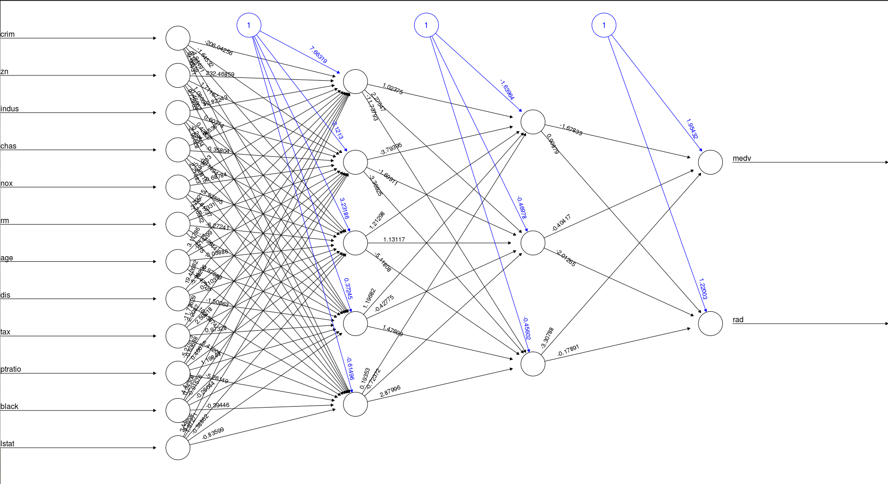

```{r setup, include=FALSE}
knitr::opts_chunk$set(echo = TRUE)
```
# Uczenie sieci neuronowej w R (przykład)

Przedstawimy teraz przykład wykorzystania pakietu neuralnet w R.

Wykorzystamy dane zgromadzone w jednym z Pakietów R a dokłądniej pakiecie MASS (zainstalować jeśli brakuje).

```{r}
set.seed(500)
library(MASS)
data <- Boston
```

Dane tam zgromadzone dotyczą mieszkań znajdujących się na przedmieściach Bostonu

```{r echo=FALSE}
help_console <- function(topic, format=c("text", "html", "latex", "Rd"),
                         lines=NULL, before=NULL, after=NULL) {  
  format=match.arg(format)
  if (!is.character(topic)) topic <- deparse(substitute(topic))
  helpfile = utils:::.getHelpFile(help(topic))

  hs <- capture.output(switch(format, 
                              text=tools:::Rd2txt(helpfile),
                              html=tools:::Rd2HTML(helpfile),
                              latex=tools:::Rd2latex(helpfile),
                              Rd=tools:::prepare_Rd(helpfile)
                              )
                      )
  if(!is.null(lines)) hs <- hs[lines]
  hs <- c(before, hs, after)
  cat(hs, sep="\n")
  invisible(hs)
}
```


```{r}
head(data)
help_console(Boston, "text", lines = 1:55, before = "", after = "")
```

Sieci neuronowe nie potrafią poradzić sobie z brakami danych na wejściu dlatego upewnijmy się, że nasze dane nie posiadają w sobie symboli NA

```{r}
## brakujące dane
apply(data,2,function(x) sum(is.na(x)))
```

W dalszej części dokonajmy podziału naszych danych na zbiory treningowe i testowe. Niech nasz podział będzie w proporcji 75:25

```{r}
index <- sample(1:nrow(data),round(0.75*nrow(data)))
train <- data[index,]
test <- data[-index,]
```

Przyjrzyjmy się co w zakresie naszych danych może zaproponować nam regresja 

```{r}
## model regresji
lm.fit <- glm(medv~., data=train)
summary(lm.fit)
## wyznaczmy błąd regresji
## najpierw przewidywanie dla zbioru testowego
pr.lm <- predict(lm.fit,test)
dt = data.frame( id =names(pr.lm), prediction = unname(pr.lm), true_val=test$medv)
dt
## a dalej jego błąd średniokwadratowy (Mean Square Error)
(MSE.lm <- sum((pr.lm - test$medv)^2)/nrow(test))
```

Chcielibyśmy, aby nasza sieć traktowała każde wejście jednakowo. Jednak informacje zgromadzone w poszczególnych kolumnach różnią się znacznie w reprezentacji. Chcąc przekształcić je do postaci mała-średnia-duża wartość dokonamy wstępnej transformacji danych - skalowania:

```{r}
## skalowanie
maxs <- apply(data, 2, max) 
mins <- apply(data, 2, min)

scaled <- as.data.frame(scale(data, center = mins, scale = maxs - mins))
head(scaled)
train_ <- scaled[index,]
test_ <- scaled[-index,]
```

Utwórzmy wzór formuły, którą chcemy nauczyć sieć 

```{r}
n <- names(train_)
mat_formula=paste("medv + rad ~", paste(n[!n %in% c("medv","rad")], collapse = " + "))
mat_formula
```

Wykorzystajmy teraz pakiet neuralnet i wytwórzmy odpowiednią sieć

```{r}
library(neuralnet)
f <- as.formula(mat_formula)
nn <- neuralnet(f,data=train_,hidden=c(3,4,3,4,5,7,3),linear.output=T)
```

Przyjrzyjmy się jej diagramowi po uczeniu

```{r}
plot(nn)
```



Przyjrzyjmy się prawdziwemu błędowi (wolnemu od skalowania). Najpierw cofnijmy transformacje danych na wejściu

```{r}
pr.nn <- compute(nn,test_[,1:12])
pr.nn_ <- pr.nn$net.result*(max(data$medv)-min(data$medv))+min(data$medv)
test.r <- (test_$medv)*(max(data$medv)-min(data$medv))+min(data$medv)
MSE.nn <- sum((test.r - pr.nn_)^2)/nrow(test_)
print(paste(MSE.lm,MSE.nn))
```

# Zapisywanie i odczytywanie sieci

Aby zapisać naszą sieć musimy wywołać

```{r eval=FALSE}
save(file='siec.rda',nn)
```

Aby ją potem odczytać

```{r eval=FALSE}
load(file='siec.rda')
```

Do przekazania sieci na zewnątrz najlepiej jest zapamiętać jej stan wag

```{r}
nn$weights
```