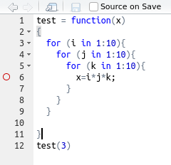
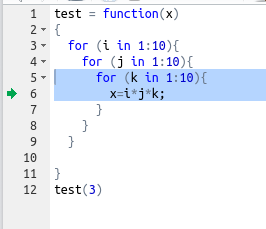
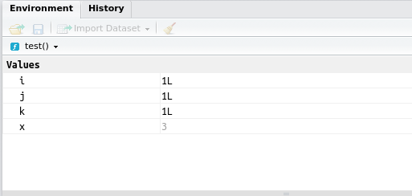
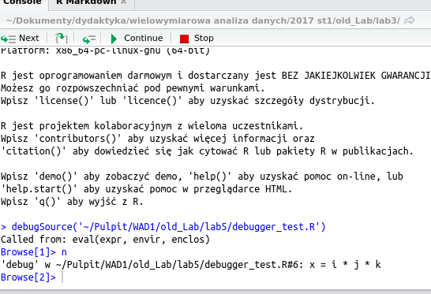

```{r echo=FALSE}
setwd('~/Workspace/projects/TS2019/extra_advanced_programiming_in_r')
```

# Kilka bardziej zaawansowanych elementów z R

## Instalacja jeśli trzeba

Czasami nie wiemy czy konieczne jest przeprowadzenie instalacji danego pakietu u kolegi z zespołu - a jest on być może konieczny do tego. Poniższa kombinacja wywołania R pozwala zmusić do instalacji pakietu (ale tylko jeśli go brak). Opiera się o funkcję require


```{r}
nazwa_pakietu = 'HistData'
czy_jest_pakiet = require(nazwa_pakietu)
if(!czy_jest_pakiet){
  install.packages(nazwa_pakietu)
}
```

## Dołączanie modułów w skrypcie.

Aby dołączyć wybrany moduł należy wykonać jedną z następujących komend

* library - powoduje dołączenie modułu/biblioteki
* require - powoduje próbę dołączenia modułu/biblioteki. Może zakończyć się sukcesem lub porażką. 

### Przykład

```{r}
require("plot3D")
```

Ano tak. A co jeśli nie mamy tego pakietu. Wtedy możemy go jeszcze zainstalować ze zdalnych repozytoriów z bibliotekami R. Można wykonać to na jeden z dwóch sposobów:

* rozwijając w menu Tools->Install packages - pozwala to zarówno na instalację ze zdalnych zasobów jak i bibliotek z paczek tar.gz
* wywołując następującą komendę 

```{}
install.package("nazwa pakietu")
```

Po instalacji do funkcji z danego modułu można uzyskać pomoc pisząc:
```{}
nazwa_pakietu::funkcja_dostepna_publicznie
nazwa_pakietu:::funkcja_dostępna_w_trybie_prywatnym
```


### Dodatkowe komendy

Wsród dodatkowych komend warto wyszczególnić:

* edit - pozwala sprawdzić kod danej funkcji
* methods - pozwala sprawdzić do jakich funkcji może się odnosić dana nazwa
* help - pozwala zobaczyć plik pomocy do danej funkcji

## Przydatne komendy matematyczne

Wśród przydatnych matematycznych funkcji warto wyszczególnić

* round
* signif
* floor
* ceiling
* trunc
* abs
* logp1 = log(1+x)
* expm1 = e^x-1
* sqrt
* det 
* solve
* "%%"" dzielenie modulo
* "%/%" dzielenie w liczbach całkowitych


### Specjalne symbole matematyczne

W efekcie błędnych przekształceń mogą pojawić się wśród danych specjalne symbole matematyczne np. NaN (Not-a-Number) lub nieskończoność Inf

```{r}
sqrt(-1)
1/0
```

Dodatkowo w R występuje specjalna metoda na oznaczenie pól z brakującymi danymi. Jest to NA (Not-Available)

```{r}
x = NA;
x
```

## Funkcje rzutujące

Z czasem chcielibyśmy patrzeć na pewne zmienne i wartości w inny sposób. Np, spojrzeć na liczbę jak na ciąg cyfr. Do wykonania tzw. rzutowowanie wykorzystuje się polecenie "as"

```{r}
x =123;
x;
y=as.character(x);
y
```

## Funkcjonały

W R funkcje mogą być traktowane jak zmienne. W szczególności jest np. możliwość wywoływania funkcji na większych niż przewidziany dokumentacją. Np. funkcja sapply przyjmuje wektor parametrów i potem iteracyjnie przesyła je do wnętrze przekazanej funkcji. 

```{r}
czyParzysta = function(x)
{
  if (x%%2==0){
    return (TRUE);
  } else {
    return(FALSE);
  }
}
x=1:14
sapply(x,czyParzysta);
sapply(x,function(x) x^2);
```

## Funkcje do pracy z ciągiem znaków:

Do pracy z ciągami znaków stosujemy następujące funkcje:

* cat - wypisywanie i łączenie znaków (konkatenacja)
* paste - sklejanie napisow
* format - formatowanie liczb
* substr - podciąg znaków
* strsplit
* nchar, toupper, tolower
* sub, gsub
* regexpr

## Funkcje weryfikacji typów

Czasem warto się upewnić jaki typ mają nasze dane. Mamy dostępne dwie metody do uzyskania informacji o zmiennych

```{r}
x='a';
class(x);
typeof(x);
```

## Zarządzanie środowiskiem pracy

R uruchamiany jest zawsze względem pewnego katalogu w systemie operacyjnym. Ma to znaczenie szczególnie gdy chodzi o wczytywanie danych z plików

* setwd
* getwd
* list.files() 
* dir()
* file
* file.choose()

## Tworzenie operatorów w R

R umożliwia nam pracę z operatorami. Niestety jednak nie umożliwia nam ich przeciążania. Pozwala jednak tworzyć nowe operatory w następujący sposób:

```{r}
"%ilo%" = function(x,y){
  return(x*y);
}

3 %ilo% 2

"%kwadrat%" = function(x,y){
  return(x*x);
}
3 %kwadrat% 1

```

Wszystkie nowo stworzone operatory muszą niestety mieć dwa parametry. Stąd składnia tego ostatniego okazuje się być taka niefortunna.

## Obiekty wywołań

W R również funkcje okazują się być zmiennymi. Stąd możliwe jest ich przekazywanie do funkcji i traktowanie jak parametrów.

```{r}
x = seq(from=1,to=10,by=1);
y = x^2;
item = call("plot",x,y,'l');
item
eval(item)
z= deparse(item)
z
```

## Przeciążanie - funkcje generyczne w R

Rodzi sie pytanie w jaki sposób wykorzystywane jest przeciążanie po stronie R. W końcu metody print czy plot działają na wiele różnych sposobów. W R realizowane jest to przez grupowanie funkcji pod częściowo wspólnymi nazwami

```{r}
test1 = function(x) UseMethod("test1");
test1.default = function(x) {
  return(0.0);
}
test1.character = function(x){
  return(1.0);
}
test1.numeric = function(x){
  return(2.0);
}
test1.array = function(x){
  return(3.0);
}

```

Dalej możemy dokonać sprawdzenia jak to dopasowanie działa

```{r}
test1(3);
test1('a')
a=c(1,2);
class(a);
typeof(a);
test1(a);
test1(1:3);
```

## Grafika 

Wszystkie Tyg{rrrrr}yski R najbardziej lubią jak ich informacje są rysowane na wykresach. Rysowanie wykresów 2D jest pewnie już dobrze znane.

```{r}
x = seq(-2*pi, 2*pi, by=0.1)
plot(x,sin(x),type="b", col="red")
lines(x,cos(x),col="green")
abline(0,0)
abline(1,0)
abline(0,1)
```

Jednak najprostsze rysowanie 3D czyli rysowanie konturowe pewnie jeszcze nie

```{r}
x=seq(from=-2,to=1,by=0.1);
y=x;

n=length(x)
m=length(y)
X = matrix(x, nrow=n,ncol=m,byrow = TRUE);
Y = matrix(y, nrow=n,ncol=m,byrow = FALSE);
#X #odkomentować aby podejrzeć
#Y
Z = Y^2 + X^2+X*Y #dzięki arytmetyce pozycyjne tu otrzymujemy macierz wartości
#Z
contour(x,y,Z,col="red")
```


## Debugger

Jednym z najprzydatniejszych narzędzi wspierających programstę jest debugger. Z samej nazwy wnosimy, iż jest to narzędzie do poszukiwania błędów w kodzie. Jego działanie jest jednak czymś szczególnym. To narzędzie która pozwala nam śledzić wykonywanie kodu i analizowanie wartośći zmiennych czy przebiegu sterowania. Aby skorzystać z jego dobrodziejstw należy wskazać miejsca w kodzie z których chcemy obserwować co dzieje się. Do tego celu ustawia się pułapki w kodzie symbolizowanie przez RStudio jako czerwone kółka:



Aby wykonać skrypt pod okien debuggera klikamy przycisk source:


Po wywołaniu i kiedy interpreter spróbuje wywołać linię z pułapką następuje zatrzymanie kody w odpowiedniej linii



Dostępny nam jest podgląd środowiska



Oraz otrzymujemy możliwość sterowania dalszym wykonaniem




# Ćwiczenia z programowania w R (przykłady)
## Przykład 1

Napisać funkcję rysującą funkcje sinus w kolorze podanym w RGB w zakresie 0-255 i informującą o błędzie dla innych danych wejścia

```{r}
coloredSinPlot = function(red,green,blue){
  x = seq(from=0, to=4, by=0.01);
  y = sin(x);
  if (red <0|| red>255||green <0 || green > 255 || blue<0 || blue>255)
  {
    paste('[ERROR] Podano parametr spoza zakresu 0-255')
  } 
  else 
  {
    color = rgb(red=red/255, green=green/255, blue=blue/255, alpha=1);
    plot(x,y,'p',col=color)
  }
}
coloredSinPlot(100,69,67);

```

## Przykład 2 

Napisać funkcję poszukującą liczb doskonałych w zakresie od 1 do podanego parametru

```{r}
doskonale = function(n){
  for (i in 2:n){
    #sprawdzanie czy jest doskonala
    temp = 0;
    for (j in 1:(i-1)){
      if (i%%j==0){
        temp = temp + j;
      }
    }
    if (temp==i){
      cat(i,', ');
    }
  }
}
doskonale(1000);

```

## Przykład 3

Jest następująca historia dotycząca jednego z największych matematyków w historii - Leonharda Eulera. 
> Prof. Euler nie mógł pewnej nocy spać. Żeby zająć umysł wypisał na kartce 100 pierwszych liczb i ich 6 pierwszych potęg. Poczym nim nastał świt nauczył się ich na pamięć.

Utwórz tablicę w której dla pierwszych stu liczb naturalnych znajduje się ich 6 pierwszych potęg i zapisz ją do pliku pamiec_eulera.txt


```{r}
a = seq(from=1,to=100,by=1);
tab=data.frame(kwadraty=a^2,szesciany=a^3,czwarte_potegi=a^4,piate_potegi=a^5,szoste_potegi=a^6)
write.csv(tab,file="pamiec_Eulera.txt")

```


# Zadania

## Zadanie 1
Korzystając z ramki danych wygeneruj tablice trygonometryczne dla wybranego zestawu kątów 

## Zadanie 2 
Utwórz funkcje, która zwróci 3 największe oraz 3 najmniejsze liczby z wektora. Jeśli wektor jest zbyt krótki, 
niech zostanie zwrócony odpowiedni komunikat

## Zadanie 3
Napisać funkcje wyświetlającą dzisiejszą date w ustalonym przez nas formacie

## Zadanie 4 
Napisać funkcje wypisującą dane przesuniętą o wskazaną liczbę dni od dzisiejszej

## Zadanie 5 
Napisac funkcje losująca jeden dzień we wskazanym roku (badanie przestepności). 
Przebadać działanie funkcji na częstość wyboru danych dni 

## Zadanie 6
Napisać funkcje, która dla przekazanego ciągu znaków dokonuje podsumowania użytych tam znaków 
(ile jakich znakow uzyto)

## Zadanie 7 
Narysować wykres funkcji $z = y^2+x \cdot y$ (wskazówka: napisać funkcje transformującą x,y na siatkę macierz)

## Zadanie 8 
Narysować funkcję zadaną współrzędnymi biegunowymi $r = 1 + \sin(t), \phi=2 \cdot \pi \cdot t$

## Zadanie 9
Wczytać kolejne linie w pliku txt. Wygenerować wykres na którym linijki 2-... są funkcjami pierwszego wiersza

## Zadanie 10

Napisać funkcje sprawdzającą czy dany rok jest przestępny.

## Zadanie 11

Napisać funkcję odczytującą datę urodzenia na podstawie numeru PESEL

## Zadanie 12

Napisz funkcje odszukujące liczby zaprzyjaźnione w zakresie od 1 do parametru.

## Zadanie 13

Napisz funkcje, która sprawdza czy podana liczba jest liczbą pierwszą.